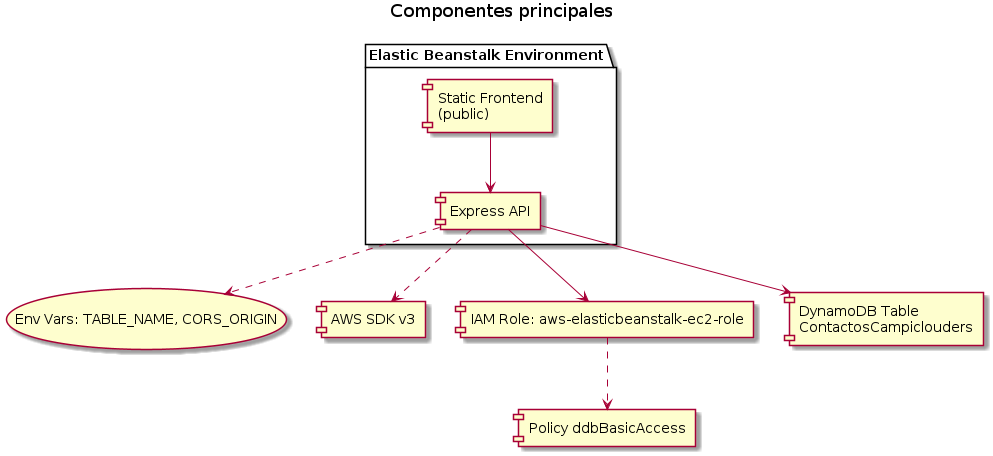
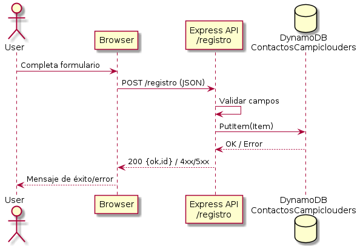
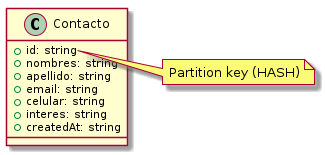
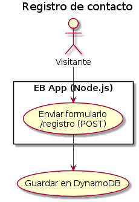
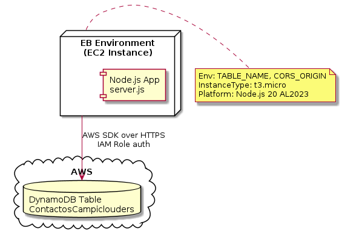

# ☁️ Proyecto EB + DynamoDB – CampiClouders

### 🚀 Descripción General
Este proyecto implementa una **aplicación web full stack en AWS**, que integra:

- **Frontend:** Sitio estático con formulario de registro (HTML + CSS).
- **Backend:** API REST construida en **Node.js + Express**.
- **Base de datos:** **DynamoDB** como servicio NoSQL en la nube.
- **Despliegue:** **AWS Elastic Beanstalk**, con integración automática del backend y el frontend.

El objetivo es **demostrar un flujo completo de registro de usuarios** en AWS, aplicando buenas prácticas de infraestructura y despliegue cloud.

---

## 🧱 Arquitectura del Proyecto

El flujo general es:

1. El usuario llena el formulario web.
2. El formulario envía los datos al endpoint `/registro` del backend (Node.js).
3. El backend inserta el registro en **DynamoDB** usando el SDK oficial de AWS.
4. Elastic Beanstalk gestiona la infraestructura y las variables de entorno.
5. Los datos pueden consultarse directamente desde la consola DynamoDB.

---

## 🗂️ Estructura de Archivos

```
EB+Dynamo/
├── main.tf              # (opcional) Ejemplo IaC con Terraform
├── server.js            # Servidor Express + conexión a DynamoDB
├── package.json         # Dependencias y scripts de ejecución
├── public/
│   ├── index.html       # Sitio web principal + formulario de registro
│   └── style.css        # Estilos del frontend
├── guia.md              # Guía de despliegue paso a paso
└── diagrams/
    ├── usecase.png
    ├── sequence.png
    ├── data_model.png
    ├── components.png
    └── deployment.png
```

---

## 🧩 Tecnologías Usadas

| Componente | Tecnología | Descripción |
|-------------|-------------|-------------|
| 🖥️ Frontend | HTML + CSS | Formulario dinámico y responsive |
| ⚙️ Backend | Node.js + Express | API REST que gestiona el registro |
| 🗄️ Base de Datos | Amazon DynamoDB | Almacenamiento NoSQL sin servidor |
| ☁️ Despliegue | AWS Elastic Beanstalk | Automatización de infraestructura |
| 🔐 Permisos | IAM Policies | Control de acceso para DynamoDB |
| 🧠 SDK AWS | @aws-sdk v3 | Conexión directa al servicio DynamoDB |

---
## 🏆 Mejores Prácticas Implementadas
Este proyecto va más allá de la funcionalidad, incorporando principios clave de ingeniería de software moderna.
### 1. Infraestructura como Código (IaC)
La infraestructura es versionable, repetible y auditable. Se proporcionan plantillas para tres métodos de despliegue, demostrando flexibilidad y dominio del ecosistema AWS:
- **Terraform:** Para una gestión declarativa y multi-nube (`main.tf`).
- **AWS CloudFormation:** Para una integración nativa con AWS (`cloudformation/eb-dynamo.yml`).
- **AWS CLI:** Para scripting y automatización (`guia_cli.md`).

### 2. Seguridad por Diseño (Security by Design)
- **Principio de Menor Privilegio:** El rol IAM de la instancia EC2 solo tiene permisos para las acciones de DynamoDB estrictamente necesarias (`PutItem`, `GetItem`, etc.), en lugar de un `dynamodb:*` genérico.
- **Roles de Instancia:** No se almacenan credenciales (claves de acceso) en el código. La aplicación las obtiene de forma segura a través del perfil de instancia IAM.
- **Bucket S3 Privado:** El bucket que almacena los artefactos de despliegue bloquea todo el acceso público por defecto.

### 3. Automatización y DevOps
- **Servicio Gestionado (PaaS):** El uso de Elastic Beanstalk abstrae la complejidad de gestionar servidores, parches, balanceadores y escalado.
- **Empaquetado Automático:** El código de Terraform usa el proveedor `archive` para crear el `.zip` de la aplicación en el momento del despliegue, asegurando la consistencia entre la infraestructura y el código.

### 4. Optimización de Costos
- **Pago por Uso:** La tabla de DynamoDB está configurada en modo `PAY_PER_REQUEST`, ideal para cargas de trabajo variables o de bajo tráfico, eliminando costos de capacidad ociosa.
- **Instancias de Bajo Costo:** Se utiliza `t3.micro` por defecto, que es parte de la capa gratuita de AWS y es eficiente para desarrollo y pruebas.
- **Guías de Limpieza:** Se proporciona una `guia_limpieza.md` centralizada con comandos para destruir todos los recursos, evitando costos inesperados.

### 5. Documentación Excepcional
El proyecto está documentado de manera exhaustiva para facilitar su comprensión, uso y aprendizaje:
- **Guías de Despliegue Detalladas:** Para cada método (Terraform, CLI, CloudFormation).
- **Diagramas de Arquitectura:** Diagramas UML para visualizar casos de uso, componentes, secuencias y el modelo de despliegue.
- **Guía de Aprendizaje Visual:** La `guia_terraform.md` incluye un mapa mental y "micro-retos" para facilitar la comprensión de IaC.

---

## 📊 Monitoreo y Observabilidad

El entorno de Elastic Beanstalk está configurado para utilizar **"Salud Mejorada" (Enhanced Health)**. Esto proporciona métricas detalladas del sistema operativo y la aplicación que van más allá de un simple "OK/FAIL", incluyendo:
- **Métricas del SO:** Carga de la CPU, memoria, etc.
- **Métricas de la Aplicación:** Latencia (p50, p90, p99), códigos de estado HTTP (2xx, 4xx, 5xx).
- **Logs Centralizados:** Los logs de la aplicación y del servidor web se pueden transmitir a CloudWatch Logs para su análisis y depuración.

Esta base se puede extender fácilmente con Terraform para incluir un **dashboard de CloudWatch** y **alarmas** que notifiquen sobre errores 5xx, alta latencia o instancias no saludables.

---
## 🚀 ¿Cómo empezar?

El proyecto ofrece múltiples guías para que puedas desplegarlo según tu herramienta preferida:
- **`README.md`**: Contiene las instrucciones básicas de instalación local y despliegue con la EB CLI.
- **`guia_terraform.md`**: Una guía visual y pedagógica para desplegar con Terraform.
- **`guia_cli.md`**: Pasos detallados para un despliegue completo usando solo la AWS CLI.
- **`guia_cloudformation.md`**: Instrucciones para usar la plantilla de CloudFormation.

---

## 🧹 Limpieza

Para evitar costos, no olvides destruir todos los recursos una vez que hayas terminado tus pruebas. Consulta `guia_limpieza.md` para obtener instrucciones consolidadas y seguras.


## 🧱 Infraestructura como Código (Terraform)

El repo incluye archivos Terraform para crear:
- DynamoDB (tabla `ContactosCampiclouders`).
- Elastic Beanstalk Application + Environment (Node.js 20 / AL2023).
- IAM para acceso mínimo a DynamoDB desde EC2 del EB.

Pasos básicos:
```
terraform init
terraform plan -out=tfplan
terraform apply "tfplan"
```
Requisitos:
- Define `platform_arn` en `terraform.tfvars` (ver `guia_terraform.md`).
- Si `aws-elasticbeanstalk-ec2-role` ya existe, ajusta `eb_ec2_role_name` o importa recursos.


Abre [http://eb-dynamo-env.eba-jq2vhiyi.us-east-1.elasticbeanstalk.com/](http://eb-dynamo-env.eba-jq2vhiyi.us-east-1.elasticbeanstalk.com/) y prueba el formulario.


## 🧾 Ejemplo de Tabla DynamoDB

| id (PK) | nombres | apellido | email | celular | interes | createdAt |
|----------|----------|-----------|---------|----------|-----------|-------------|
| `uuid` | Ana | Pérez | ana@correo.com | 3000000000 | curso-aws | 2025-10-29T15:00:00Z |

---

## 🧹 Limpieza del Laboratorio

Para eliminar los recursos creados:

```bash
eb terminate eb-dynamo-env
aws dynamodb delete-table --table-name ContactosCampiclouders
```

---

## 📊 Diagramas del Proyecto

| Tipo | Imagen |
|------|--------|
| 🧩 Componentes |  |
| 🔁 Secuencia |  |
| 💾 Modelo de Datos |  |
| 🧭 Casos de Uso |  |
| ☁️ Despliegue |  |

---

## 👥 Equipo CampiClouders

| Integrante               | Rol |
|--------------------------|-----|
| José David Escalante     | Arquitecto / Desarrollador |
| Maria Alejandra Caicedo  | Backend |
| Daniela Torres           | Frontend |
| David Quiceno            | DevOps |
| Alejandro Franco Cedeño  | QA / Documentación |

---

## 💬 Conclusión

Este proyecto demuestra una **integración completa entre un backend Node.js y DynamoDB**, desplegado automáticamente con **Elastic Beanstalk**, aplicando prácticas reales de infraestructura como código y despliegue en la nube.  
Es ideal como laboratorio educativo y punto de partida para soluciones sin servidor (serverless) en AWS.

---

📘 **Autor:** CampiClouders Team  
🗓️ **Bootcamp Cloud & DevOps 2025**  
☁️ *CampiClouders – Innovación desde la Nube*

---

## 🔗 Limpieza avanzada
Para una guía consolidada de desmontaje (Terraform, CLI, CloudFormation, consola web), consulta `guia_limpieza.md`.

---

