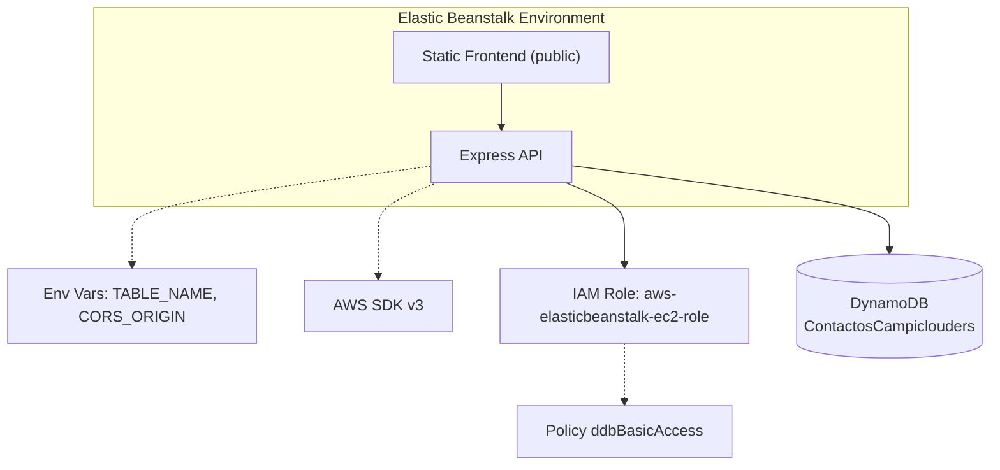

```mermaid
flowchart TB
  subgraph EB[Elastic Beanstalk Environment]
    Static["Static Frontend (public)"] --> API[Express API]
  end
  API -.-> Env[Env Vars: TABLE_NAME, CORS_ORIGIN]
  API -.-> SDK[AWS SDK v3]
  API --> Role[IAM Role: aws-elasticbeanstalk-ec2-role]
  Role -.-> Policy[Policy ddbBasicAccess]
  API --> DDB[(DynamoDB\nContactosCampiclouders)]

```